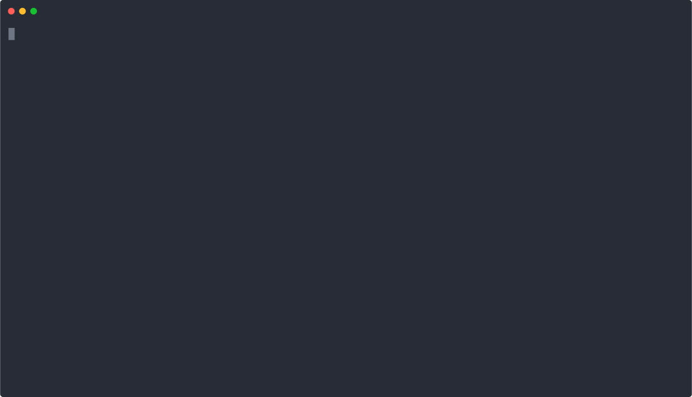

# Hexlet tests and linter status:
[](https://github.com/Skenzi/frontend-project-lvl1/actions)
[](https://codeclimate.com/github/Skenzi/frontend-project-lvl1)
[](https://github.com/Skenzi/frontend-project-lvl1/actions)

## About games

### brain-even

In this game, you must specify whether the number is even or not.

### brain-calc

In this game, you need to calculate what will happen in the expression.

### brain-gcd

In this game you need to find out the greatest common divisor of the number.

### brain-progression

In this game you will be given a series of numbers in which one number is omitted, you must specify this number.

### brain-prime

In this game, you need to specify whether the number is Prime.

## Asciinems
Demo:

[](https://asciinema.org/a/382110)
Other games:

[](https://asciinema.org/a/382111)
[](https://asciinema.org/a/382112)
[](https://asciinema.org/a/382113)
[](https://asciinema.org/a/382114)

## Install

```sh
make install
```

## Run game

```sh
brain-<name game> // brain-calc, brain-progression etc.

or

make brain-<name game> // brain-calc, brain-progression etc.
```
